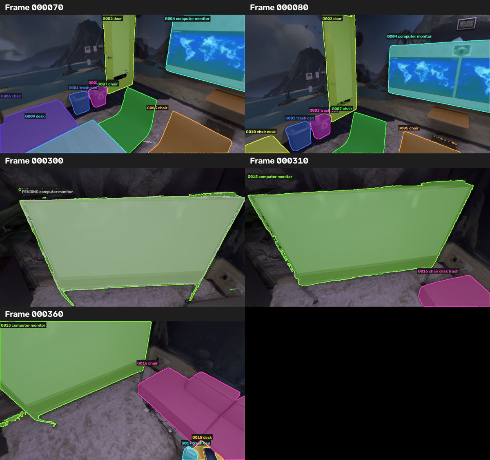
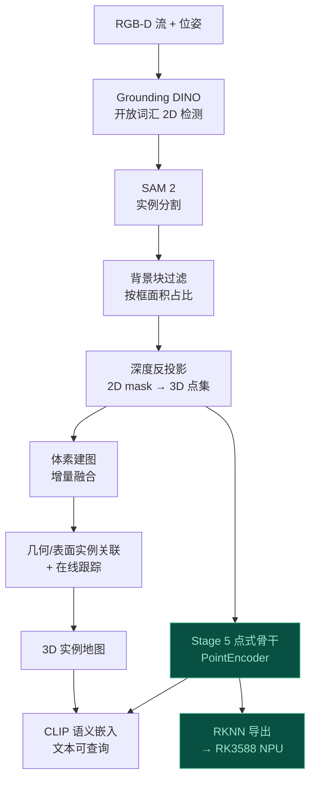

# Efficient Online Open-Vocabulary 3D Scene Perception for Edge Robotics

面向端侧机器人的**在线开放词汇 3D 场景感知** —— 从 RGB-D 流实时构建可文本查询的 3D 实例地图，
并把点云骨干压缩部署到国产 NPU（RK3588）。

**English** — An online, training-free open-vocabulary 3D instance perception pipeline for edge robots:
RGB-D stream → 2D open-vocabulary detection & segmentation → 3D lifting → incremental voxel mapping →
geometric instance association & tracking → text-queryable instance map. The point backbone is then
rewritten into an NPU-deployable form and shipped to a Rockchip RK3588 (6 TOPS INT8).

---

## 目录

- [效果](#效果)
- [这是什么](#这是什么)
- [系统架构](#系统架构)
- [量化结果](#量化结果)
- [快速开始](#快速开始)
- [目录结构](#目录结构)
- [技术难点与解法](#技术难点与解法)
- [局限](#局限)
- [参考](#参考)

---

## 效果

<!-- 放一张 tracking_contact_sheet.png 或 3D 实例图 -->



在 Replica 的 **8 个 Nice-SLAM RGB-D 标准场景**（office_0–4、room_0–2，
每场景 200 帧、步长 10）上，与官方语义网格反投影出的 GT 实例掩码对比
（宏平均，逐场景指标见 [`docs/RESULTS.md`](docs/RESULTS.md) §1.5）：

| 指标 | 数值 |
|---|---|
| 实例 AP@IoU 0.25 | **0.608** |
| 实例 AP@IoU 0.50 | **0.519** |
| 关联：GT 对象单轨保持率 | **0.706** |
| 关联：轨道碎片率 | **1.363**（越低越好，1.0 为完美） |
| 语义标签一致性 | **0.984** |

**开放词汇文本检索**（CLIP 图像嵌入 × 文本查询，6 类常见词，按「物体存在」
的场景宏平均 AP）：chair 0.84 / trash can 0.82 / sofa 0.77 / desk 0.73 /
door 0.63 / computer monitor 0.23（显示器召回 100%，弱在检索排序，见局限）。

**实时性**：RTX 3090 单进程在线推理 **6.15 FPS（162 ms/帧）**，瓶颈是
Grounding DINO（~130 ms）。

> 单场景老口径（office0 61 帧）：AP@.25 0.703、单轨率 0.556、标签一致性 0.975，
> 见 RESULTS.md §1。多场景把单轨率从 0.556 提到 0.706、碎片率从 1.77 降到 1.36，
> 关键是改用体素覆盖率关联修掉了 track 碎片化。

---

## 这是什么

一条**免训练**的在线 3D 感知流水线，输入是带位姿的 RGB-D 序列，输出是一张
**类别无关的 3D 实例地图**，每个实例带一个**开放词汇语义嵌入**（CLIP 空间），
因此可以用任意自然语言查询场景（"可以坐的东西在哪"、"哪里有插座"）。

设计上的两个关键取舍：

1. **实例形成不依赖语义。** 物体的"是一个独立个体"可以纯靠几何与多帧一致性判定，
   语义只在实例稳定后才贴上去。这样实例分组不会因为见到没见过的类别而崩。
2. **不用稀疏卷积。** 点式方案零额外依赖，天然处理在线融合点云的变密度问题，
   而且**在 NPU 上可量化、可部署** —— 稀疏卷积的动态索引在 RKNN 上几乎不可实现。

---

## 系统架构



---

## 量化结果

> 每个数字的来源文件与复现命令见 **[`docs/RESULTS.md`](docs/RESULTS.md)**；
> 指标定义（AP / 碎片率 / 四个 IoU 口径 / 延迟口径）见 **[`docs/METRICS.md`](docs/METRICS.md)**。

### 1. 在线感知（Replica office0，61 帧）

> 这是最早的单场景口径（office0 61 帧）。多场景的 8 个 Nice-SLAM 标准序列评测见
> 下方 §1.5 与 `docs/RESULTS.md` —— 单轨率从 0.556 提到 0.706、碎片率从 1.77 降到 1.36。

| 指标 | 数值 |
|---|---|
| AP@IoU 0.25 | 0.703 |
| AP@IoU 0.50 | 0.314 |
| 语义标签一致性 | 0.975 |
| 关联：匹配到的 GT 对象 | 9 |
| 关联：预测轨道数 | 13 |

### 1b. 单进程推理延迟（RTX 3090，200 帧）

原来的 30.74 s/帧里有 **90% 是脚手架开销**（每帧 spawn 子进程、重复加载权重、写盘、渲染预览）。
改成单进程、模型只加载一次、默认不落盘后，再叠加 fp16 推理与 SAM2 hiera-tiny：

| 阶段 | 均值 |
|---|---|
| Grounding DINO（2D 检测，fp16） | 135.6 ms |
| SAM 2（实例分割，hiera-tiny） | 17.2 ms |
| 深度反投影 + 3D 提升 | 9.8 ms |
| **合计** | **162.5 ms** |

**6.15 FPS，比旧口径（388.4 ms / 2.57 FPS）快 2.4×。** 纯 2D 推理（检测 + 分割）
= 152.8 ms，占单帧 **94%**——瓶颈明确在开放词汇检测器，与 OVI-MAP 类系统的结论一致。
写盘与预览渲染是另一笔开销（~1.7 s/帧），但**不参与实时推理**，可在部署时关闭。

复现：`python -m tools.benchmark_latency --frames 0 10 20 ... --warmup 3`
（多场景实测见 `outputs/multiscene_eval_v2/<scene>/latency.json`）

### 1c. 开放词汇文本检索（CLIP）

把每个融合 3D 实例的逐帧掩码裁剪送进 CLIP 图像编码器，按掩码面积加权平均得到
实例嵌入；文本查询编码后与实例嵌入做余弦排序。用 Replica 语义网格反推出的 GT
类别（与检测器词表解耦）算检索 AP——这是「可文本查询的 3D 实例地图」这条产品主线的
核心指标。评测 8 场景、6 个常见查询词，按「**物体确实存在**的场景」宏平均（避免把
没有该物体的场景记成 0 分）：

| 查询 | 存在场景 AP | 说明 |
|---|---|---|
| chair | **0.840** | 稳 |
| trash can | **0.818** | 稳 |
| sofa | 0.769 | 稳 |
| desk | 0.734 | 稳 |
| door | 0.625 | 中等 |
| computer monitor | **0.229** | 弱：召回 100%，但排序靠后（详见局限） |

整体（存在场景）平均 AP **0.669**；含「无该物体」场景的口径为 0.556。
复现：`python -m tools.run_multiscene_open_vocab --scenes office_0 office_1 ...`

### 2. Stage 5 点式骨干（87 类，975,975 参数）

**按场景划分，不是按块划分** —— 训练/验证/测试用的是**完全不同的房间**：

| 划分 | 场景 | 点数 | 准确率 | mIoU | 宏平均 mIoU | 支撑度≥200 的 mIoU | 频次加权 IoU |
|---|---|---|---|---|---|---|---|
| train | 12 个（apartment / frl_apartment / hotel / office） | 3.6M | — | — | — | — | — |
| val | office_2 / office_3 / office_4 | 591,964 | 0.540 | 0.152 | 0.198 | 0.186 (22/30 类) | 0.477 |
| **test** | room_0 / room_1 / room_2 | 593,653 | **0.587** | **0.163** | **0.225** | **0.193 (32/38 类)** | 0.473 |

逐场景：

| 场景 | 准确率 | mIoU | 支撑度≥200 的 mIoU |
|---|---|---|---|
| office_2 | 0.596 | 0.238 | 0.336 |
| office_3 | 0.528 | 0.147 | 0.212 |
| office_4 | 0.496 | 0.210 | 0.260 |
| room_0 | 0.653 | 0.245 | 0.286 |
| room_1 | 0.558 | 0.217 | 0.241 |
| room_2 | 0.550 | 0.213 | 0.247 |

**两个值得注意的点**：

1. **测试集（从未参与选模型）比验证集更好**（mIoU 0.163 vs 0.152，宏平均 0.225 vs 0.198）
   —— 没有在验证集上过拟合。测试集里房间类场景见到的类别还更多（38 vs 30 类）。
2. 表现好的类别是**结构面 + 大件家具**：ceiling 0.90 / rug 0.56 / lamp 0.55 /
   floor 0.54 / wall 0.49 / table 0.47 / chair 0.38。差的都是长尾小物体
   —— 这也是宏平均 mIoU 被拖低的原因，所以同时报告"支撑度≥200"与"频次加权"两个口径。
   详见 `docs/METRICS.md`。

> 数据来源：`outputs/stage5/run_s5b_metricfix/{eval_val,eval_test}.json`。
> 复现：`python -m tools.evaluate_point_encoder --checkpoint .../best.pt --split test`

### 3. NPU 部署可行性（ONNX 静态分析，RKNN 支持表比对）

| 档位 | 导出器 | 总节点 | 可上 NPU | 必须留 CPU |
|---|---|---|---|---|
| 完整图（含 Morton 编码 + kNN） | TorchScript opset 12 | **导出失败** | — | — |
| 完整图（仅作量级参考） | dynamo opset 17 | 3425 | 2662 (77.7%) | **678 (19.8%)** |
| **Morton 编码移出** | TorchScript opset 12 | 719 | 665 (**92.5%**) | **24 (3.3%)** |
| + kNN 移出 | TorchScript opset 12 | 639 | 594 (93.0%) | 15 (2.3%) |

含 Morton 编码的完整图**在部署路径下根本导不出来**，而且不是 opset 的问题：

| opset | 结果 |
|---|---|
| 12 / 13 / 15 / 17 | `ONNX export does NOT support exporting bitwise AND` |
| 18 / 19 / 20 | `ONNX export does NOT support exporting bitwise OR` |

也就是说，Morton 的位运算**连 ONNX 这一关都过不去**，不需要等到上 NPU 才被拒绝。
只把 Morton 编码移出图，CPU 侧负担就从 678 个节点降到 24 个（同一导出器口径下 −96%）。

### 4. RKNN 可部署形态（改写后）

| 指标 | 数值 |
|---|---|
| 部署图节点数 | 705 |
| 算子种类 | 22 |
| **不支持的算子** | **0**（Erf / Sqrt / ReduceL2 全部消灭） |
| 数值等价：最大相对偏差 | **5.5e-4** |
| 数值等价：语义 argmax 一致率 | **99.951%** |

---

## 快速开始

```bash
# 环境：Python 3.10+，PyTorch 2.x（开发环境是 torch 2.5.1+cu121）
pip install -r requirements.txt

# 0. 准备数据：把 Replica 原始场景放成 datasets/raw/replica_v1/<scene>/
#    再把带 RGB-D + 位姿的序列放成 datasets/processed/Replica/<scene>/
#    （results/frame*.jpg、results/depth*.png、traj.txt）

# 1. 生成 GT 实例掩码（从 Replica mesh_semantic.ply 反投影）
python -m tools.generate_gt_instance_masks \
    --scene-directory datasets/processed/Replica/office0 \
    --replica-scene office_0 \
    --output-directory outputs/gt/office0

# 2. 跑在线流水线（回放采样帧）
python -m tools.run_instance_sequence \
    --scene-directory datasets/processed/Replica/office0 \
    --run-directory outputs/experiments/office0_run

# 3. 与 GT 对比评测（AP + 轨道碎片率/纯度）
python -m tools.evaluate_against_gt \
    --tracking-json outputs/experiments/office0_run/association/tracking.json \
    --segmentation-root outputs/experiments/office0_run/segmentation \
    --gt-root outputs/gt/office0 \
    --output outputs/experiments/office0_run/gt_eval.json

# 4. 构建点云数据集并训练 Stage 5 点式骨干（自动 12/3/3 按场景划分）
python -m tools.build_mesh_point_dataset --output-directory outputs/point_dataset
python -m tools.train_point_encoder \
    --dataset-root outputs/point_dataset \
    --output-directory outputs/stage5/run \
    --epochs 60 --num-points 8192 --lr 2e-3

# 5. 跨场景评测（val / test 都是训练时没见过的房间）
python -m tools.evaluate_point_encoder \
    --checkpoint outputs/stage5/run/best.pt \
    --dataset-root outputs/point_dataset --split test \
    --output outputs/stage5/run/eval_test.json

# 6. 导出 RKNN 可部署形态（含数值等价性校验）
python -m tools.rknn_export --onnx-out deploy/point_encoder_rknn.onnx
```

### 测试与审计

```bash
python -m tools._smoke_test_rknn_export   # RKNN 导出路径：4 条工程保证
python -m tools.rknn_op_audit             # 算子兼容性审计（不需要任何硬件）
python -m tools.benchmark_latency --frames 0 10 20 30 --warmup 3   # 单进程延迟基准
```

`rknn_op_audit` 与 `benchmark_latency` 都**不需要 RK3588 硬件**，
前者做 ONNX 静态分析，后者用桌面 GPU 测推理延迟。

---

## 目录结构

```
.
├── src/
│   ├── perception/      # 2D 检测/分割、CLIP 编码
│   ├── geometry/        # 反投影、体素建图、几何关联
│   ├── mapping/         # 增量实例地图与跟踪
│   ├── models/          # PointEncoder、RKNN 导出
│   └── datasets/        # Replica 读取、点云块数据集
├── tools/               # 所有可执行脚本（python -m tools.xxx）
├── docs/                # 指标口径、审计报告、设计文档
└── outputs/             # 实验产物（gitignore）
```

---

## 技术难点与解法

这一节记录踩过的坑和对应的解法 —— 也是这个项目里最花时间的部分。

### 1. 推理时漏了归一化，整场景评测直接腰斩

**现象**：按块评测 mIoU 0.158，整场景评测只有 0.066。

**根因**：训练时每个点云块都会被归一化（平移到质心 + 缩放到单位球），
但推理时 `encode_cloud_in_blocks` 直接把**世界坐标**喂给了模型。
第一层 MLP 和邻域相对坐标全部落在训练分布之外。

**定位方式**：把同一片点云整体 ×3 并平移 (100, −50, 20)，
比较归一化前后的预测一致性 —— 归一化后 **1.0000**，不归一化只有 **0.3580**。

**修复后**：准确率 0.369 → 0.523，宏平均 mIoU 0.066 → 0.142，
30 个类别里有 IoU 的从 11 个升到 21 个。

### 2. 训练日志打印的是最弱的那条分支

**现象**：验证 mIoU 曲线一直平在 0.12–0.16，但监督语义损失从 0.64 掉到 0.14。

**根因**：开了文本嵌入之后，`evaluate()` 用**开放词汇分支**
（`text_embedding @ text_bank.T()`）做预测，而这条分支的损失权重只有 0.1。
`best.pt` 也就一直按这个最弱的分支在选。

**修复**：同时评测两条分支，`SELECTION_METRIC = "semantic.miou"`。
修复后两种准则选出的 checkpoint 确实不同（epoch 49 vs 34）。

### 3. 宏平均 mIoU 被长尾噪声主导

87 个类别里大部分在验证集上只有个位数点数，IoU 恒为 0，把宏平均拖到 0.167，
而频次加权是 0.454。**修复**：从同一个混淆矩阵同时产出
`miou` / `miou_supported`（≥200 点）/ `frequency_weighted_iou` 三个口径 + 每类支持度。

> **注意区分**：支持度**大**但 IoU 恰好为 0 的类别是**真失败**，不是长尾。
> 当前仍有 7 个这样的类别（bench / blinds / non-plane / pipe / stool / tv-stand / wall-plug）。

### 4. 一个 3.3 GB 的临时张量把评测卡死

`((block[:,None,:] - ref[None,:,:])**2).sum(-1)` 在 B=1024 / N=50000 / C=16 时
会实体化 3.3 GB 的中间张量。改成展开形式
（`b² − 2b·rᵀ + r²`）后峰值降到 164 MB，整场景评测 **540 s → 102 s（5.3×）**。

### 5. 把骨干改成 NPU 能跑的样子

RK3588 的 NPU 走 RKNN 工具链，算子覆盖比 TensorRT 差得多。静态分析图节点后发现，
含 Morton 编码的完整图**在部署路径下根本导不出来**：

| opset | 部署路径（TorchScript）的结果 |
|---|---|
| 12 / 13 / 15 / 17 | `ONNX export does NOT support exporting bitwise AND` |
| 18 / 19 / 20 | `ONNX export does NOT support exporting bitwise OR` |

**每一个 opset 都失败。** 这比"RKNN 不支持位运算"更强 ——
Morton 的位运算连 ONNX 这一关都过不去，不需要等到上 NPU 才被拒绝。

把动态算子移出图之后，剩下的障碍是三类算子：

- **Morton 编码（位运算）** 是位运算，RKNN 完全不支持；
- **kNN（TopK / Gather / GatherElements）** 是动态索引，NPU 张量引擎不支持非连续内存访问；
- **GELU 的 `Erf`**、**LayerNorm / L2 归一化的 `Sqrt` / `ReduceL2`** 不在支持列表里。

**解法**：

| 问题 | 解法 | 结果 |
|---|---|---|
| Morton 编码在图内 | 索引提到图外，由 CPU 提供 | CPU 侧负担 **678 → 24 节点**（−96%） |
| kNN 动态索引 | 留 CPU（本来就边界清晰） | 只剩 `GatherElements` ×15 |
| `Erf`（GELU） | 换 tanh 近似 | 偏差 4.7e-4 |
| `Sqrt`（LayerNorm） | 换 `Pow(var+eps, -0.5)` | 偏差 4.8e-7 |
| `ReduceL2`（L2 归一化） | 换 `Pow(Σx², -0.5)` | 偏差 6.0e-8 |
| `Sqrt`（反距离加权） | 换 `Pow(‖Δ‖²+ε², -0.5)` | 偏差 0 |

**训练路径完全不动** —— 替换发生在深拷贝出的副本上，`state_dict` 键不变，
已有 checkpoint 双向兼容。整模型数值等价由 `_smoke_test_rknn_export.py` 把关。

最终部署图 **705 节点 / 22 类算子 / 0 个不支持的算子**。

> 一个值得记录的诊断：`Pow(x, -0.5)` 会不会被导出器拆成 `Sqrt + Reciprocal`？
> **取决于指数是 Python float 还是张量**。实测 `torch.pow(v, -0.5)`（float 标量）
> 得到干净的 `Pow`；而 `torch.rsqrt(v)` 变成 `Sqrt + Div`、
> `1.0/torch.sqrt(v)` 变成 `Sqrt + Reciprocal`，两个都白改。

> 一个意外收获：我们的 Morton 序子采样天然满足 RK3588 的内存局部性要求
> （公开的 RK3588 PointNet 部署记录里，作者必须手动按空间排序才能让 NPU
> 沿点维规约跑起来）。这本来是为了避免 FPS 的 O(N·M) 代价做的选择，
> 在 NPU 部署上变成了优势。

---

## Demo A 可视化交付（不只是指标看板）

完整评测之外，Demo A 还提供了**可交互的 3D 文本查询地图**与一段**实时建图视频**，
直接展示项目核心卖点——「用一句话在 3D 地图里找出物体」。

### 1. 交互式 3D 文本查询地图（主交付物）

`outputs/demo_a_viewer/`（由 `tools/build_viewer_data.py` 生成数据，`index.html` + 本地 vendored
Three.js 渲染）打开即是一个浏览器内的 3D 实例点云查看器，支持：

- **8 个 Nice-SLAM 场景**切换，轨道旋转 / 滚轮缩放 / 右键平移；
- **真实 RGB / 按类别 / 按实例**三种着色；
- **文本查询高亮**：底部预设查询按钮（椅子、显示器、沙发…共 30 个）用烘焙好的
  CLIP 文本嵌入即时高亮命中实例；自由文本框则调用**浏览器内 CLIP 文本塔**
  （transformers.js，真·开放词汇，CDN 不可达时自动回退预设）；
- **「建图回放」滑块 / 播放按钮**：按 `first_seen_frame` 逐步揭示实例，
  模拟 RGB-D 相机走过时地图实时生长的过程。

复现：

```bash
# 1) 生成 8 场景紧凑数据（点云 + CLIP 嵌入 + 首次出现帧 + 烘焙查询）
/miniconda3/bin/python3 -m tools.build_viewer_data \
    --eval-root outputs/multiscene_eval_v2 --all --output outputs/demo_a_data --max-points 2000
# 2) 本地起服务并打开
cd outputs/demo_a_viewer && python3 -m http.server 8137
#   浏览器访问 http://localhost:8137/index.html

# 3) 打包成自包含单文件（内联 Three.js + 全部 8 场景数据，约 6.5 MB）
python -m tools.build_selfcontained_viewer
#   产出 demo_a/demo_a_viewer_standalone.html
#   —— 不依赖服务器、不联网，下载到本地双击即可打开
```

> 注意：多文件版依赖 `data/` 与 `vendor/` 相对路径，必须经 http 服务打开；
> 而沙箱里的 `localhost:8137` 只在沙箱内部可达，外部浏览器访问不到。
> 因此对外交付一律用第 3 步的**自包含单文件**。

### 2. 实时建图短视频（mp4）

`tools/make_demo_video.py` 用 matplotlib 离屏渲染一段「逐步建图 + 文本查询高亮」视频
（默认 office_0，查询 `chair`）：**1280×720 / 15fps / 8 秒**，前 70% 按 `first_seen_frame`
逐步揭示实例模拟在线建图，后 30% 演示文本查询高亮。输出
`outputs/demo_video/office_0_demo.mp4`，可直接嵌进幻灯片。

查询高亮使用**自适应阈值**（`max_score − max(0.02, std)`）而非固定阈值：CLIP 图文
余弦值挤在 0.20–0.30 的窄带内，固定阈值 0.20 会把 19 个实例全部判为命中、整屏全黄。

```bash
/miniconda3/bin/python3 -m tools.make_demo_video \
    --data outputs/demo_a_data --scene office_0 --query chair --frames 120
```

### 3. 关于换更强开放词汇检测器

在 office_1 上实测了 **Grounding DINO base**（可用的最强本地权重）对比 tiny：
几何 AP@.25/AP@.50、碎片率、标签一致性**与 tiny 完全一致**，显示器聚类仍是 2 个，
检测延迟仅 135ms→~155ms。结论：**换 base 对显示器召回和整体精度零收益**，
不值得为它牺牲实时性。显示器弱点是 Replica 合成小屏本身 + 开放词汇概念映射问题，
需多尺度 / 更高分辨率检测或专属小物体检测器才能根治，已列为已知局限。

---

## 局限

诚实列出，避免误导：

- **小屏显示器检索弱 —— 已定位为「排序问题」，不是漏检。** 开放词汇里 computer
  monitor 的存在场景 AP 只有 0.229。实测三点，纠正此前的误判（曾误记为「18 个
  GT 显示器只检出 2–3 个」）：
  - **召回其实是 100%**：8 个场景里仅 office_0 / office_1 各含 1 个 GT 显示器
    （其余 6 个场景 GT 数为 0），两场景 recall 均为 **1.0** —— 显示器都进了地图。
  - **弱在 CLIP 检索排序**：office_0 真显示器排第 1（AP 1.0），office_1 排第 7
    （AP = 1/7 ≈ 0.143，p@5 = 0）；且每场景会多出 1 个误标为 monitor 的实例。
  - **多尺度检测已验证无效**：把检测分辨率从默认短边 800 提到 1200（必须覆盖
    processor 的 `size`；单纯放大输入图会被再次归一化而完全无效），office_1
    显示器检出数 18 → 17（不升反微降），单帧耗时 164ms → 453ms（**×2.75**）。
    叠加此前 Grounding DINO base 零收益的结论：**不更换检测器、不启用多尺度**。
- **精度不占优。** AP@0.50 只有 0.519（8 场景宏平均），掩码 IoU ≥0.5 的比例约 64%。
  过分割是主要问题，根因在 2D 分割前端 —— 这与 OVI-MAP 论文 Table 5 的结论一致
  （SAM2 → CropFormer 让 instance AP50 从 27.8 涨到 50.8）。
- **在线流水线只在 8 个 Nice-SLAM 场景评过。** 这 8 个是社区标准 RGB-D 序列，
  轨迹天然覆盖家具，比自渲染序列可信。其余 10 个 Replica 场景（apartment / frl /
  hotel）只有 mesh / semantic，需自行渲染 RGB-D + 位姿才能纳入，故未进 headline。
  Stage 5（点式骨干）不受这个限制，已做 12/3/3 的跨场景划分（见 §2）。
- **RK3588 尚未实测。** 部署可行性来自 ONNX 静态分析 + RKNN 支持表比对，
  **没有在真机上跑过**。RKNN 支持表依据的是 toolkit v1.7.5 文档，
  早于 RK3588 的 toolkit2 线，逐算子细节仍需用
  `RKNN_OP_Support_And_Limit.xlsx` 复核。
- **功耗未测。** 需要 USB-C 功率计。
- **端到端延迟≠边缘实测。** 桌面 GPU 单进程 **162.5 ms/帧（6.15 FPS）** 已是实时档，
  但这是 RTX 3090 的数字，不等于 RK3588 上的表现，两者之间还隔着量化与 CPU/NPU 切分。

---

## 参考

本项目在实现过程中参考并对比了以下工作：

- **ESAM** — *EmbodiedSAM: Online Segment Any 3D Thing in Real Time* (ICLR 2025)
- **ESAM++** — SFPN: 用稀疏特征金字塔替换 3D sparse UNet
- **OVI-MAP** — *Open-Vocabulary Instance-Semantic Mapping* (CVPR 2026)
- **FOLK** — *Fast Open-Vocabulary 3D Instance Segmentation via Label-guided Knowledge Distillation*
- **AutoSeg3D** — *Online Segment Any 3D Thing as Instance Tracking* (NeurIPS 2025)
- **OpenMask3D** — *Open-Vocabulary 3D Instance Segmentation*
- **PointNet++** — Set Abstraction / Feature Propagation 结构
- **Grounding DINO** / **SAM 2** — 开放词汇检测与分割
- **Replica** — 数据集

---

## 许可

MIT
